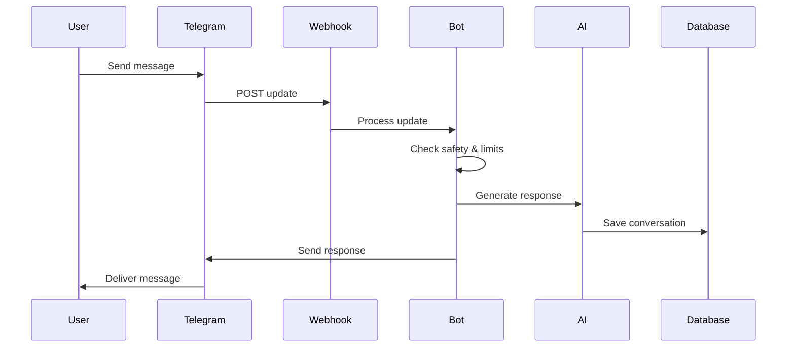

# Telegram Integration for Risedial

## Overview

The Telegram integration provides a complete conversational interface for the Risedial AI therapeutic companion. Users can interact with the system through Telegram messages, receive therapeutic support, track their progress, and access crisis intervention when needed.

## Architecture

### Core Components

1. **Webhook Handler** (`src/api/telegram-webhook.ts`)
   - Processes incoming Telegram updates
   - Validates webhook security tokens
   - Routes messages to the bot processor

2. **Main Bot Class** (`src/lib/telegram-bot.ts`)
   - Handles message processing and command routing
   - Integrates with AI orchestrator for therapeutic responses
   - Manages user sessions and subscription limits
   - Provides crisis intervention and safety protocols

3. **Session Manager** (`src/lib/session-manager.ts`)
   - Maintains conversation context and user state
   - Tracks message history for AI context
   - Manages session expiration and cleanup

4. **Setup Scripts** (`scripts/setup/setup-webhook.ts`)
   - Configures Telegram webhook endpoints
   - Validates environment variables
   - Tests webhook connectivity

## Features

### Commands
- `/start` - Initialize conversation and create user profile
- `/help` - Display available commands and usage information
- `/status` - Show subscription status, usage metrics, and limits
- `/progress` - Generate therapeutic progress report
- `/upgrade` - Display subscription upgrade options

### Message Processing
- **Natural Conversation**: Process freeform text messages
- **Crisis Detection**: Automatic identification of crisis situations
- **Therapeutic Response**: AI-generated therapeutic support
- **Progress Tracking**: Invisible metrics collection and analysis
- **Cost Monitoring**: Real-time usage and cost tracking

### Safety Features
- **Crisis Intervention**: Immediate response to crisis keywords
- **Resource Provision**: Emergency contact information
- **Professional Referrals**: Connection to human support
- **Safety Validation**: Message content filtering

## Setup Instructions

### 1. Environment Variables

Create a `.env.local` file with the following variables:

```bash
# Telegram Configuration
TELEGRAM_BOT_TOKEN=your_bot_token_from_botfather
WEBHOOK_SECRET_TOKEN=your_secure_random_string

# Webhook URL (auto-detected in Vercel)
WEBHOOK_URL=https://your-domain.vercel.app/api/telegram-webhook

# Database Configuration
SUPABASE_URL=your_supabase_url
SUPABASE_SERVICE_ROLE_KEY=your_service_role_key

# AI Configuration
OPENAI_API_KEY=your_openai_api_key
```

### 2. Create Telegram Bot

1. Message [@BotFather](https://t.me/botfather) on Telegram
2. Use `/newbot` command to create a new bot
3. Choose a unique bot name and username
4. Copy the bot token to your environment variables
5. Set bot commands using `/setcommands`:

```
start - Begin or restart conversation
help - Show available commands
status - Check usage and subscription
progress - View therapeutic progress
upgrade - Upgrade subscription
```

### 3. Deploy and Configure Webhook

```bash
# Install dependencies
npm install

# Deploy to Vercel
npm run build
vercel --prod

# Set up webhook
npm run setup-webhook
```

### 4. Test Integration

1. Start a conversation with your bot on Telegram
2. Send `/start` to initialize
3. Send a test message to verify AI responses
4. Check logs for any errors or issues

## API Reference

### TelegramBot Class

#### Methods

##### `processUpdate(update: any): Promise<void>`
Main entry point for processing Telegram updates.

**Parameters:**
- `update`: Telegram update object containing message or callback query

**Example:**
```typescript
const bot = new TelegramBot();
await bot.processUpdate(webhookUpdate);
```

##### `setupWebhook(webhookUrl: string): Promise<boolean>`
Configures the Telegram webhook endpoint.

**Parameters:**
- `webhookUrl`: Full URL to your webhook endpoint

**Returns:**
- `boolean`: Success status of webhook setup

##### `getWebhookInfo(): Promise<WebhookInfo>`
Retrieves current webhook configuration from Telegram.

**Returns:**
- `WebhookInfo`: Current webhook status and configuration

### SessionManager Class

#### Methods

##### `buildMessageContext(userId: string): Promise<MessageContext>`
Creates conversation context for AI processing.

**Parameters:**
- `userId`: Telegram user ID as string

**Returns:**
- `MessageContext`: Complete context object for AI orchestrator

##### `incrementMessageCount(sessionId: string): Promise<void>`
Updates session message counter for usage tracking.

**Parameters:**
- `sessionId`: Unique session identifier

## Message Flow



## Error Handling

### Webhook Errors
- Invalid secret token → 401 Unauthorized
- Malformed update → 500 Internal Server Error
- Rate limiting → Temporary service degradation

### Bot Errors
- AI service unavailable → Fallback error message
- Database connection issues → Graceful degradation
- Crisis detection failures → Default safety response

### Recovery Mechanisms
- Automatic retry for transient failures
- Fallback responses for AI service issues
- Manual intervention alerts for critical errors

## Monitoring and Analytics

### Key Metrics
- **Response Time**: AI generation + message delivery
- **Success Rate**: Successful message processing percentage
- **Crisis Detection**: Accuracy and response time
- **User Engagement**: Messages per session, session frequency
- **Cost Tracking**: Token usage and API costs per user

### Alerts
- Crisis events detected
- High API costs per user
- Webhook delivery failures
- Unusual error patterns

### Logs
```typescript
// Structured logging format
{
  timestamp: "2024-01-15T10:30:00Z",
  level: "info",
  event: "message_processed",
  userId: "123456789",
  responseTime: 1250,
  tokensUsed: 450,
  cost: 0.012,
  crisisLevel: 1
}
```

## Security Considerations

### Webhook Security
- Secret token validation on all requests
- HTTPS-only webhook endpoints
- Request payload validation

### Data Privacy
- Message encryption in transit
- User data isolation in database
- Automatic session cleanup
- GDPR compliance features

### Crisis Safety
- Immediate resource provision for high-risk users
- Professional escalation protocols
- Emergency contact integration
- Safety keyword monitoring

## Subscription Management

### Tier Limits
```typescript
const TIER_LIMITS = {
  basic: {
    dailyMessages: 15,
    monthlyLimit: 15.00,
    features: ['basic_chat', 'crisis_detection']
  },
  premium: {
    dailyMessages: 50,
    monthlyLimit: 35.00,
    features: ['all_basic', 'progress_tracking', 'insights']
  },
  unlimited: {
    dailyMessages: 1000,
    monthlyLimit: 75.00,
    features: ['all']
  }
};
```

### Upgrade Flow
1. User hits message limit
2. Upgrade prompt with inline keyboard
3. Payment processing (external integration)
4. Subscription tier update
5. Immediate feature access

## Development Guidelines

### Code Organization
- Keep message handlers focused and simple
- Separate business logic from Telegram-specific code
- Use dependency injection for testability
- Implement comprehensive error handling

### Testing Strategy
```bash
# Unit tests
npm run test:unit

# Integration tests
npm run test:integration  

# Crisis detection validation
npm run test:crisis

# Load testing
npm run test:load
```

### Performance Optimization
- Message compression for long conversations
- Intelligent context pruning
- Response caching for common queries
- Batch processing for database operations

## Troubleshooting

### Common Issues

**Bot not responding to messages:**
- Verify webhook URL is accessible
- Check environment variables
- Confirm bot token is valid
- Review webhook secret configuration

**AI responses not generating:**
- Verify OpenAI API key
- Check cost limits and quotas
- Review AI orchestrator logs
- Validate message context building

**Database errors:**
- Confirm Supabase connection
- Check RLS policies
- Verify table schemas
- Review connection pool settings

**Crisis detection not working:**
- Test crisis keyword patterns
- Verify crisis handler configuration
- Check emergency resource URLs
- Validate escalation procedures

### Debug Commands
```bash
# Test webhook connectivity
curl -X GET https://your-domain.vercel.app/api/telegram-webhook

# Validate environment
npm run validate-env

# Check webhook status
npm run setup-webhook

# View logs
vercel logs --follow
```

## Deployment Checklist

- [ ] Environment variables configured
- [ ] Telegram bot created and configured
- [ ] Database schema deployed
- [ ] Webhook endpoint accessible
- [ ] SSL certificate valid
- [ ] Crisis resources verified
- [ ] Emergency escalation tested
- [ ] Monitoring alerts configured
- [ ] Legal compliance reviewed
- [ ] Privacy policy updated

## Contributing

When adding new features:

1. Follow the existing code patterns
2. Add comprehensive error handling
3. Include unit and integration tests
4. Update documentation
5. Consider security implications
6. Test crisis scenarios thoroughly
7. Validate cost impact
8. Review legal compliance

## Support

For technical issues:
- Check logs in Vercel dashboard
- Review database query performance
- Monitor API usage and costs
- Validate webhook delivery status

For crisis situations:
- Emergency contacts: 911, 988
- Crisis text line: 741741
- Professional escalation protocols
- Manual intervention procedures 